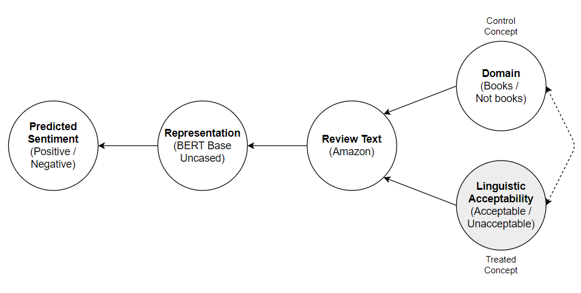
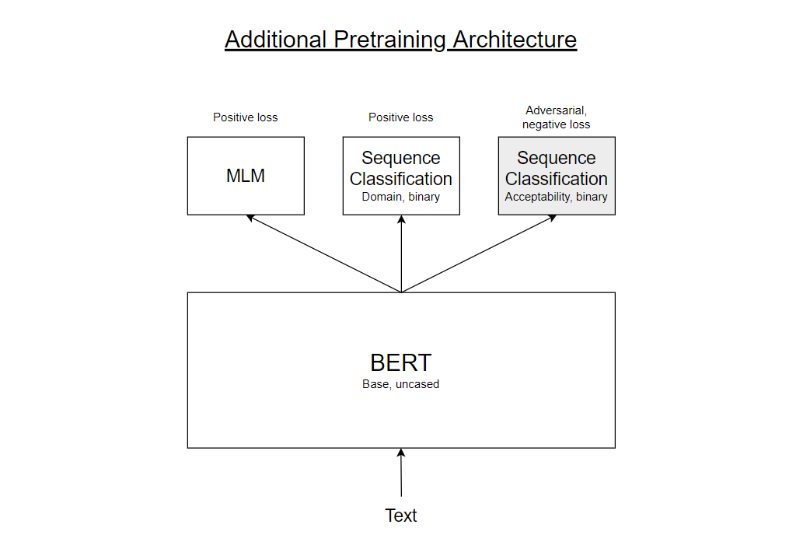
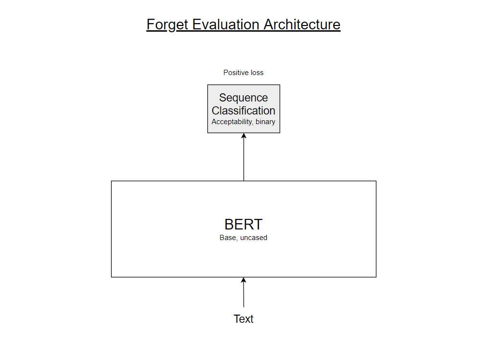

# Sentiment / Acceptability / Domain
This document includes details on the SAD experiment.

## Details
* Treated concept (TC): Linguistic Acceptability (CoLA), binary.
* Control concept (CC): Domain (Amazon Reviews), binary.
* Objective ("Task"): Sentiment prediction (Amazon Reviews), binary.

## Goals
* Forget the TC.
* Remember the CC.
* Predict sentiment.
* Generalize better out-of-sample (correlate acceptability and sentiment on purpose).

## Causal Graph

## Architecture
### Additional pretraining

### Forget TC evaluation

[comment]: <> (### Remember CC evaluation)
[comment]: <> (![RememberEvalArchitecture]&#40;figures/remember_eval_architecture.png&#41;)